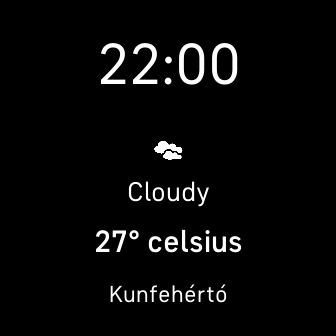

# sdk-weather-clock

Expanded Fitbit SDK example application which demonstrates the Companion Weather API, display weather icons and Weather Condition text.

The companion fetches weather data using the Companion Weather API and sends it
to the device using the File Transfer API. 

Find out more information on the
[Fitbit Developer Website](https://dev.fitbit.com).

## Know Issue

There is a bug in the Simulator and in Android, that seems to don't export that WeatherCondition variables. Wait for the fix do not use in production this solution.

## Thank you

[@SergioMorchon](https://github.com/SergioMorchon)

@monolachedan

## License

This example is licensed under the [MIT License](./LICENSE).
